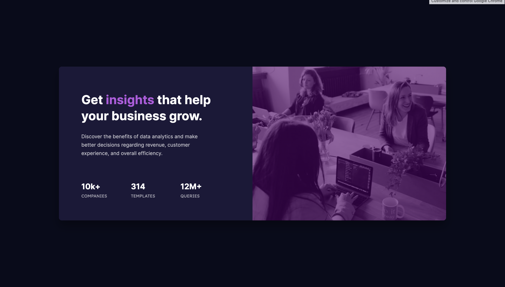

# Frontend Mentor - Stats preview card component solution

This is a solution to the [Stats preview card component challenge on Frontend Mentor](https://www.frontendmentor.io/challenges/stats-preview-card-component-8JqbgoU62).

## Table of contents

- [Overview](#overview)
  - [The challenge](#the-challenge)
  - [Screenshot](#screenshot)
  - [Links](#links)
- [My process](#my-process)
  - [Built with](#built-with)
  - [What I learned](#what-i-learned)
- [Author](#author)

## Overview

### The challenge

Users should be able to:

- View the optimal layout depending on their device's screen size

### Screenshot



### Links

- Solution URL: [Add solution URL here](https://your-solution-url.com)
- Live Site URL: [Add live site URL here](https://your-live-site-url.com)

## My process

### Built with

- Semantic HTML5 markup
- CSS custom properties
- Flexbox
- CSS Grid
- Desktop-first workflow

### What I learned

I learned how to use background-position to make sure that certain parts of the background-image is visible no matter the size of it's container.

```html
<div
  class="stat-img-box"
  role="img"
  aria-label="People working on their laptops at office"
></div>
```

```css
/* style.css */
.stat-img-box {
  background-image: linear-gradient(
      rgba(70, 0, 100, 0.6),
      rgba(70, 0, 100, 0.6)
    ), url(../images/image-header-desktop.jpg);
  background-size: cover;
  border-top-right-radius: 0.5rem;
  border-bottom-right-radius: 0.5rem;
}

/* queries.css */
.stat-img-box {
  grid-row: 1 / 2;

  width: 100%;
  height: 100%;
  background-size: cover;
  background-position-y: center;
  background-repeat: no-repeat;

  border-top-left-radius: 0.5rem;
  border-top-right-radius: 0.5rem;
  border-bottom-right-radius: 0;
}
```

## Author

- Frontend Mentor - [@kongguksu](https://www.frontendmentor.io/profile/kongguksu)
